# zKart.shop — Database ER Diagram

Auto-generated from the actual Django models — **45 application tables** (Django/DRF internal auth, session, and JWT-blacklist tables are not shown — those add roughly 10-12 more).

View this on GitHub (renders natively), or paste into https://mermaid.live to explore interactively.

```mermaid
erDiagram
    ADDRESSES {
        UUIDField id PK
        ForeignKey user FK
        CharField label
        CharField address_line
        CharField landmark
        CharField city
        CharField state
        CharField pincode
        DecimalField latitude
        DecimalField longitude
        BooleanField is_default
        DateTimeField created_at
    }
    OTPS {
        UUIDField id PK
        CharField phone
        CharField code
        CharField purpose
        BooleanField is_used
        PositiveSmallIntegerField attempts
        DateTimeField created_at
        DateTimeField expires_at
    }
    USERS {
        CharField password
        BooleanField is_superuser
        UUIDField id PK
        CharField phone
        CharField email
        CharField full_name
        CharField role
        BooleanField is_phone_verified
        BooleanField is_email_verified
        CharField google_id
        FileField avatar
        BooleanField is_active
        BooleanField is_staff
        DateTimeField date_joined
        DateTimeField last_login
        CharField referral_code
        ForeignKey referred_by FK
    }
    CARTS {
        UUIDField id PK
        OneToOneField user FK
        CharField coupon_code
        DateTimeField created_at
        DateTimeField updated_at
    }
    CART_ITEMS {
        UUIDField id PK
        ForeignKey cart FK
        ForeignKey product FK
        PositiveIntegerField quantity
        DateTimeField created_at
    }
    WISHLIST_ITEMS {
        UUIDField id PK
        ForeignKey user FK
        ForeignKey product FK
        DateTimeField added_at
    }
    BRANDS {
        UUIDField id PK
        CharField name
        SlugField slug
        FileField logo
        BooleanField is_active
    }
    CATEGORIES {
        UUIDField id PK
        CharField name
        SlugField slug
        ForeignKey parent FK
        FileField icon
        PositiveSmallIntegerField display_order
        BooleanField is_active
    }
    PRODUCTS {
        UUIDField id PK
        ForeignKey vendor FK
        ForeignKey category FK
        ForeignKey brand FK
        CharField name
        SlugField slug
        TextField description
        CharField unit
        DecimalField mrp
        DecimalField selling_price
        CharField sku
        CharField barcode
        PositiveIntegerField stock_quantity
        BooleanField is_available
        BooleanField is_featured
        JSONField nutrition_info
        JSONField tags
        DecimalField rating_avg
        PositiveIntegerField rating_count
        DateTimeField created_at
        DateTimeField updated_at
    }
    PRODUCT_ATTRIBUTES {
        UUIDField id PK
        ForeignKey product FK
        CharField name
        CharField value
        PositiveSmallIntegerField display_order
    }
    PRODUCT_IMAGES {
        UUIDField id PK
        ForeignKey product FK
        FileField image
        BooleanField is_primary
        PositiveSmallIntegerField display_order
    }
    PRODUCT_VARIANTS {
        UUIDField id PK
        ForeignKey product FK
        CharField name
        CharField sku
        DecimalField mrp
        DecimalField selling_price
        PositiveIntegerField stock_quantity
        BooleanField is_available
        PositiveSmallIntegerField display_order
    }
    REVIEWS {
        UUIDField id PK
        ForeignKey product FK
        ForeignKey customer FK
        PositiveSmallIntegerField rating
        CharField comment
        BooleanField is_approved
        DateTimeField created_at
        DateTimeField updated_at
    }
    BLOG_POSTS {
        UUIDField id PK
        CharField title
        SlugField slug
        CharField excerpt
        TextField content
        FileField cover_image
        BooleanField is_published
        DateTimeField published_at
        DateTimeField created_at
        DateTimeField updated_at
    }
    CONTACT_MESSAGES {
        UUIDField id PK
        CharField name
        CharField email
        CharField phone
        CharField subject
        TextField message
        CharField status
        DateTimeField created_at
    }
    FAQS {
        UUIDField id PK
        CharField question
        TextField answer
        PositiveSmallIntegerField display_order
        BooleanField is_active
        DateTimeField created_at
    }
    FOOTER_LINKS {
        UUIDField id PK
        CharField section
        CharField label
        CharField url
        PositiveSmallIntegerField display_order
        BooleanField is_active
    }
    MEDIA_ASSETS {
        UUIDField id PK
        FileField file
        CharField alt_text
        ForeignKey uploaded_by FK
        DateTimeField created_at
    }
    PAGES {
        UUIDField id PK
        CharField title
        SlugField slug
        TextField content
        BooleanField is_active
        DateTimeField updated_at
        DateTimeField created_at
    }
    CORE_AUDITLOG {
        UUIDField id PK
        ForeignKey user FK
        CharField method
        CharField path
        PositiveSmallIntegerField status_code
        GenericIPAddressField ip_address
        DateTimeField created_at
    }
    DELIVERY_ATTENDANCE {
        UUIDField id PK
        ForeignKey delivery_partner FK
        DateField date
        DateTimeField check_in_time
        DateTimeField check_out_time
    }
    DELIVERY_PROFILES {
        UUIDField id PK
        OneToOneField user FK
        CharField vehicle_type
        CharField vehicle_number
        CharField license_number
        CharField status
        BooleanField is_online
        DecimalField current_latitude
        DecimalField current_longitude
        DateTimeField last_location_update
        DecimalField rating_avg
        PositiveIntegerField rating_count
        DateTimeField created_at
    }
    DELIVERY_TRANSACTIONS {
        UUIDField id PK
        ForeignKey delivery_partner FK
        CharField type
        DecimalField amount
        CharField order_reference
        CharField description
        DateTimeField created_at
    }
    STOCK_BATCHES {
        UUIDField id PK
        ForeignKey product FK
        ForeignKey warehouse FK
        CharField batch_number
        PositiveIntegerField quantity
        DecimalField purchase_price
        CharField supplier_name
        DateField expiry_date
        DateField received_date
        DateTimeField created_at
    }
    STOCK_MOVEMENTS {
        UUIDField id PK
        ForeignKey product FK
        CharField movement_type
        IntegerField quantity_delta
        PositiveIntegerField resulting_stock
        CharField reference
        CharField notes
        ForeignKey created_by FK
        DateTimeField created_at
    }
    VENDOR_WAREHOUSES {
        UUIDField id PK
        ForeignKey vendor FK
        CharField name
        CharField address_line
        BooleanField is_default
        BooleanField is_active
        DateTimeField created_at
    }
    BANNERS {
        UUIDField id PK
        CharField title
        FileField image
        CharField link_url
        CharField position
        PositiveSmallIntegerField display_order
        BooleanField is_active
        DateTimeField valid_from
        DateTimeField valid_to
        DateTimeField created_at
    }
    OFFERS {
        UUIDField id PK
        CharField title
        CharField description
        FileField image
        CharField discount_label
        CharField link_url
        PositiveSmallIntegerField display_order
        BooleanField is_active
        DateTimeField valid_from
        DateTimeField valid_to
        DateTimeField created_at
    }
    SLIDERS {
        UUIDField id PK
        CharField title
        CharField subtitle
        FileField image
        CharField link_url
        PositiveSmallIntegerField display_order
        BooleanField is_active
        DateTimeField valid_from
        DateTimeField valid_to
        DateTimeField created_at
    }
    NOTIFICATIONS {
        UUIDField id PK
        ForeignKey user FK
        CharField type
        CharField title
        CharField body
        JSONField data
        BooleanField is_read
        DateTimeField created_at
    }
    COUPONS {
        UUIDField id PK
        CharField code
        CharField discount_type
        DecimalField discount_value
        DecimalField max_discount
        DecimalField min_order_value
        DateTimeField valid_from
        DateTimeField valid_to
        PositiveIntegerField usage_limit
        PositiveIntegerField used_count
        BooleanField is_active
    }
    ORDERS {
        UUIDField id PK
        CharField order_number
        ForeignKey customer FK
        ForeignKey vendor FK
        ForeignKey delivery_address FK
        ForeignKey delivery_partner FK
        CharField status
        CharField payment_method
        CharField payment_status
        CharField razorpay_order_id
        CharField razorpay_payment_id
        DecimalField subtotal
        DecimalField delivery_charge
        DecimalField discount_amount
        CharField coupon_code
        DecimalField grand_total
        CharField delivery_otp
        CharField pickup_otp
        CharField cancel_reason
        DateTimeField placed_at
        DateTimeField accepted_at
        DateTimeField delivered_at
        DateTimeField cancelled_at
        DateTimeField updated_at
    }
    ORDER_ITEMS {
        UUIDField id PK
        ForeignKey order FK
        ForeignKey product FK
        CharField product_name
        CharField unit
        DecimalField price
        PositiveIntegerField quantity
    }
    ORDER_STATUS_HISTORY {
        UUIDField id PK
        ForeignKey order FK
        CharField from_status
        CharField to_status
        ForeignKey changed_by FK
        DateTimeField changed_at
    }
    PAYMENT_METHOD_CONFIGS {
        UUIDField id PK
        CharField code
        CharField label
        BooleanField is_enabled
        DecimalField extra_fee
        DecimalField min_order_value
        PositiveSmallIntegerField display_order
    }
    AI_REPORTS {
        UUIDField id PK
        DateField report_date
        TextField summary_text
        JSONField raw_data
        CharField model_used
        DateTimeField created_at
    }
    BACKUP_LOGS {
        UUIDField id PK
        CharField filename
        BigIntegerField size_bytes
        CharField status
        TextField error_message
        ForeignKey triggered_by FK
        DateTimeField started_at
        DateTimeField finished_at
    }
    CITIES {
        UUIDField id PK
        CharField name
        CharField state
        DecimalField delivery_charge
        DecimalField free_delivery_threshold
        BooleanField is_active
        DateTimeField created_at
    }
    PLATFORM_SETTINGS {
        PositiveSmallIntegerField id PK
        DecimalField default_commission_percent
        DecimalField default_delivery_charge
        DecimalField default_free_delivery_threshold
        PositiveSmallIntegerField order_accept_timeout_minutes
        BooleanField maintenance_mode
        DecimalField referral_bonus_referrer
        DecimalField referral_bonus_referred
        DateTimeField updated_at
    }
    STAFF_PERMISSIONS {
        UUIDField id PK
        OneToOneField user FK
        BooleanField can_manage_vendors
        BooleanField can_manage_delivery_partners
        BooleanField can_manage_orders
        BooleanField can_manage_coupons
        BooleanField can_manage_categories
        BooleanField can_manage_users
        BooleanField can_view_reports
        DateTimeField created_at
        DateTimeField updated_at
    }
    WAREHOUSES {
        UUIDField id PK
        CharField name
        ForeignKey city FK
        CharField address_line
        DecimalField latitude
        DecimalField longitude
        BooleanField is_active
        DateTimeField created_at
    }
    VENDORS {
        UUIDField id PK
        OneToOneField owner FK
        CharField shop_name
        CharField category
        CharField gst_number
        DecimalField commission_percent
        CharField status
        CharField address_line
        CharField city
        ForeignKey city_ref FK
        DecimalField latitude
        DecimalField longitude
        BooleanField is_open
        DateTimeField created_at
    }
    VENDOR_TRANSACTIONS {
        UUIDField id PK
        ForeignKey vendor FK
        CharField type
        DecimalField amount
        CharField order_reference
        CharField description
        DateTimeField created_at
    }
    REFERRALS {
        UUIDField id PK
        ForeignKey referrer FK
        OneToOneField referred_user FK
        BooleanField reward_credited
        DateTimeField reward_credited_at
        DateTimeField created_at
    }
    WALLET_TRANSACTIONS {
        UUIDField id PK
        ForeignKey user FK
        CharField type
        CharField reason
        DecimalField amount
        CharField order_reference
        CharField description
        ForeignKey created_by FK
        DateTimeField created_at
    }
    USERS ||--o{ CORE_AUDITLOG : "user"
    USERS ||--o{ USERS : "referred_by"
    USERS ||--o{ ADDRESSES : "user"
    CITIES ||--o{ WAREHOUSES : "city"
    USERS ||--o{ BACKUP_LOGS : "triggered_by"
    USERS ||--|| STAFF_PERMISSIONS : "user"
    USERS ||--|| VENDORS : "owner"
    CITIES ||--o{ VENDORS : "city_ref"
    VENDORS ||--o{ VENDOR_TRANSACTIONS : "vendor"
    CATEGORIES ||--o{ CATEGORIES : "parent"
    VENDORS ||--o{ PRODUCTS : "vendor"
    CATEGORIES ||--o{ PRODUCTS : "category"
    BRANDS ||--o{ PRODUCTS : "brand"
    PRODUCTS ||--o{ PRODUCT_IMAGES : "product"
    PRODUCTS ||--o{ PRODUCT_ATTRIBUTES : "product"
    PRODUCTS ||--o{ PRODUCT_VARIANTS : "product"
    PRODUCTS ||--o{ REVIEWS : "product"
    USERS ||--o{ REVIEWS : "customer"
    USERS ||--|| CARTS : "user"
    CARTS ||--o{ CART_ITEMS : "cart"
    PRODUCTS ||--o{ CART_ITEMS : "product"
    USERS ||--o{ WISHLIST_ITEMS : "user"
    PRODUCTS ||--o{ WISHLIST_ITEMS : "product"
    USERS ||--o{ ORDERS : "customer"
    VENDORS ||--o{ ORDERS : "vendor"
    ADDRESSES ||--o{ ORDERS : "delivery_address"
    USERS ||--o{ ORDERS : "delivery_partner"
    ORDERS ||--o{ ORDER_ITEMS : "order"
    PRODUCTS ||--o{ ORDER_ITEMS : "product"
    ORDERS ||--o{ ORDER_STATUS_HISTORY : "order"
    USERS ||--o{ ORDER_STATUS_HISTORY : "changed_by"
    USERS ||--|| DELIVERY_PROFILES : "user"
    USERS ||--o{ DELIVERY_TRANSACTIONS : "delivery_partner"
    USERS ||--o{ DELIVERY_ATTENDANCE : "delivery_partner"
    USERS ||--o{ NOTIFICATIONS : "user"
    VENDORS ||--o{ VENDOR_WAREHOUSES : "vendor"
    PRODUCTS ||--o{ STOCK_BATCHES : "product"
    VENDOR_WAREHOUSES ||--o{ STOCK_BATCHES : "warehouse"
    PRODUCTS ||--o{ STOCK_MOVEMENTS : "product"
    USERS ||--o{ STOCK_MOVEMENTS : "created_by"
    USERS ||--o{ MEDIA_ASSETS : "uploaded_by"
    USERS ||--o{ WALLET_TRANSACTIONS : "user"
    USERS ||--o{ WALLET_TRANSACTIONS : "created_by"
    USERS ||--o{ REFERRALS : "referrer"
    USERS ||--|| REFERRALS : "referred_user"
```

